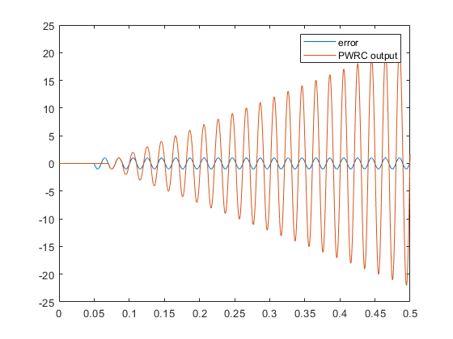

# Validation of PWRC

- input:
  - 0, [0, 50) milliseconds, 50 Hz grid frequency, controller not activated
  - unit sine wave, [50, 250) milliseconds, 49.5 Hz grid frequency, controller activated
  - unit sine wave, [250, 500) milliseconds, 50.5 Hz grid frequency, controller activated
- Q filter: $0.05 z +  0.9 + 0.05 z^{-1}$
- k: 1.0
- lead steps: 11
