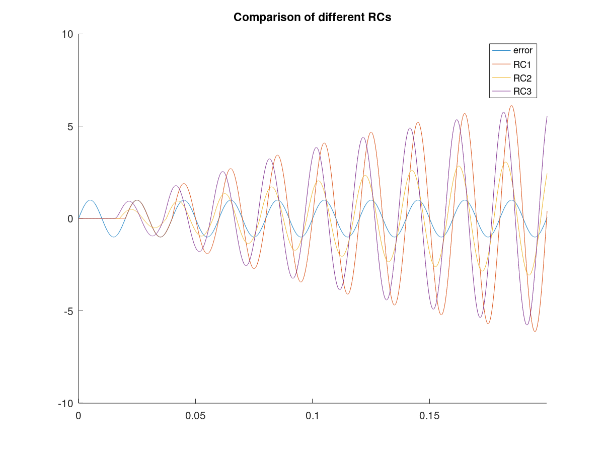

# Validation of baseline repetitive controller

- A Q value of 0.9 is used with no lead steps and compensation filter.

- Comparison of RCs with different parameters setup.

1. error: sine wave with an aplitude of 1
2. RC1: q = 0.9, lead steps = 0, k = 1.0, no compensator
3. RC1: q = 0.9, lead steps = 25, k = 0.5, no compensator
4. RC1: q = 0.9, lead steps = 50, k = 1.0, a low-pass compensator
